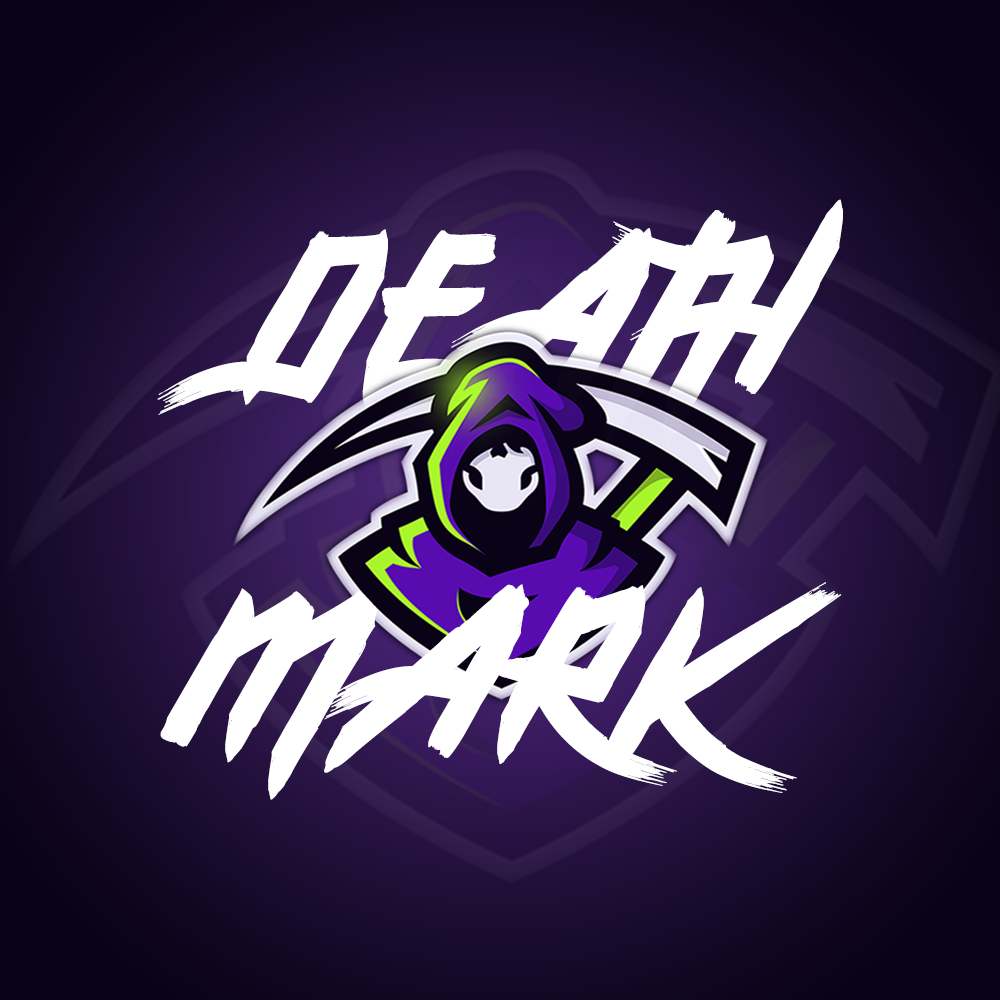

# Overseer

 

    
  <h3 align="center">Overseer Discord bot</h3>

  

    An awesome multi-feature bot for the DeathMark 2.0 Discord
     
    ·
    <a href="https://github.com/othneildrew/Best-README-Template/issues">Report Bug</a>
    ·
    <a href="https://github.com/othneildrew/Best-README-Template/issues">Request Feature</a>
  

<!--

-->
